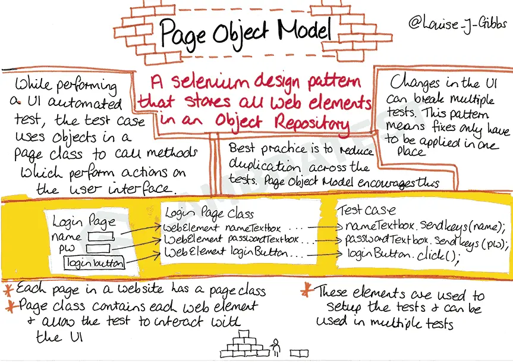
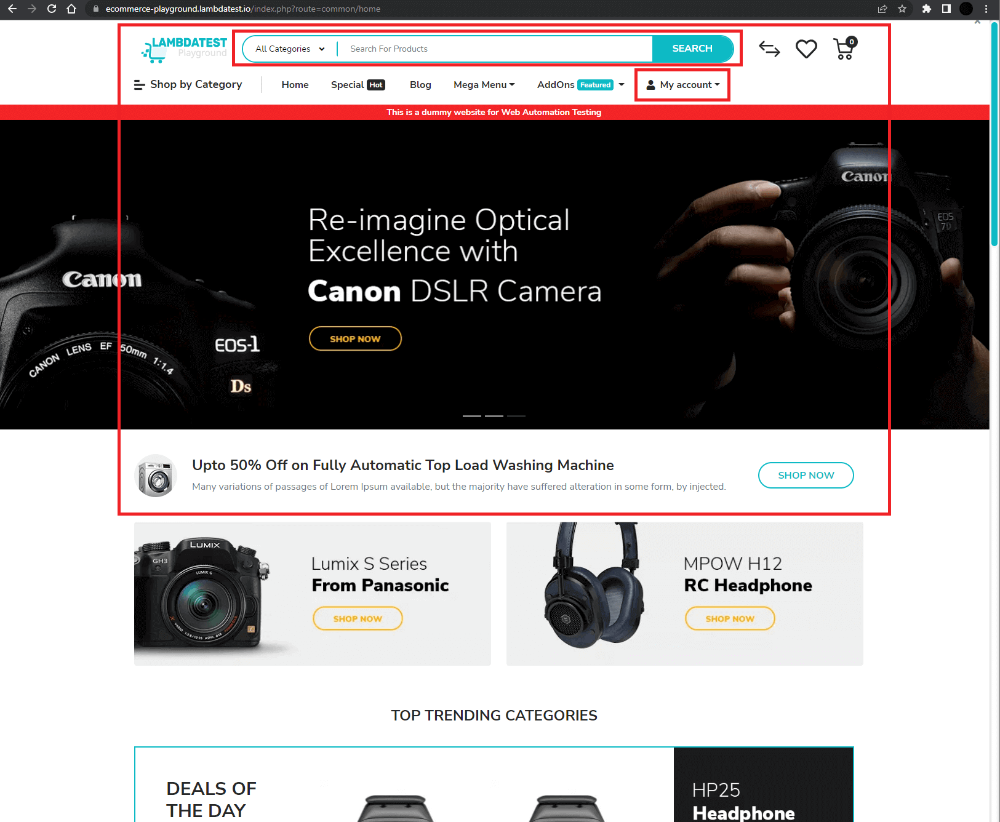

# Playwright Work

This repo is a playground for PlayWright fiddling

## Notes
### Initial Setup If Starting From Scratch
```
npm init playwright@latest
```
Prompts:
yes, TypeScript, tests, false, yes

Install VS Code Extension For Testing

### Installing Playwright If Cloning

```
npm i --save-dev @playwright/test;
npx playwright install;
npm install;
```

### What Is a Page Object Model?
Popularly known as POM, Page Object Model is a design pattern that creates a repository for storing all web elements. It is useful in reducing code duplication and improves test script maintenance.

In Page Object Model, consider each `web page` of an application `as a separate class file.` 

Each class file will contain `only corresponding web page elements.` 

Using these elements, testers can perform operations on the website under test.

Think of it like a more specific version of the page object you'd normally use when testing page.



#### We Also Can Do More Than Just Individual Pages, We Can Do Reusable Components
 

### Annotations?
* Playwright has a built-in annotation system that allows you to mark test cases with metadata.

Useful for grouping tests, or for skipping tests based on the environment.

`test.skip()` marks the test as irrelevant. Playwright does not run such a test. Use this annotation when the test is not applicable in some configuration.
`test.fail()` marks the test as failing. Playwright will run this test and ensure it does indeed fail. If the test does not fail, Playwright will complain.
`test.fixme()` marks the test as failing. Playwright will not run this test, as opposed to the fail annotation. Use fixme when running the test is slow or crashes.
`test.slow()` marks the test as slow and triples the test timeout.

```
npx playwright test --grep @Canada
```
This will run all tests that have the annotation `@Canada` in the test function name

### Fixtures?

[Fixtures are a way to create reusable code that can be used across multiple tests.]()

### Debugging & Trace
```
npx playwright test --ui
```
This will open the UI for the test runner which is great for debugging

```
npx playwright test --project --trace on
npx playwright test show-report
```